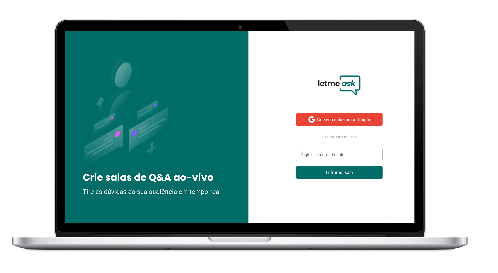

<h1 align="center"></h1>

<p align="center">
    
    
</p>



## Tecnologias Utilizadas no projeto :construction:

- [Node.js](https://nodejs.org/en/) 
- [ReactJS](https://pt-br.reactjs.org/) 
- [Firebase](https://console.firebase.google.com) 
- [typescript](https://www.typescriptlang.org/) 
- [Sass](https://sass-lang.com/) 
- [Axios](https://github.com/axios/axios) 


## Projeto :computer:

Este projeto e uma pagina de um podcast com paginas estaticas providas pelo Nextjs,
os podcasts serão fornecidos através de um arquivo json para nossa API.

## Como executar :gear:

- Clone o repositório `https://github.com/DioenDJS/Projeto-Letmeask.git`.
- Install as dependências com o comando `npm install`.
- Rode o `npm start` para iniciar a aplicação.<br />
Ao final a aplicação estará disponível em `http://localhost:3000`.

## Dependências do Projetos :card_index_dividers:

> - create-react-app
>
> ```npx create-react-app letmeask --template typescript ```

> - firebase 
>
> ``npm install firebase``

> - node-sass 
>
> ``npm install node-sass@^5.0.0``


## Fonts utilizadas no projeto :page_with_curl:


- [Roboto - 400 500](https://fonts.google.com/specimen/Roboto?query=roboto)
- [Poppins - 400 700](https://fonts.google.com/specimen/Poppins)

```
<link rel="preconnect" href="https://fonts.gstatic.com" crossorigin>
<link href="https://fonts.googleapis.com/css2?family=Poppins:wght@400;700&family=Roboto:wght@400;500&display=swap" rel="stylesheet">
```


## Aprendizado:
> - O que aprendi neste projeto foi trabalhar com Firebase
